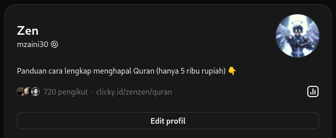

# Mempersiapkan Threads

Buatlah profil seperti ini:

Perhatikan di bagian bio dan link.

Untuk link, kita masukkan link produk kita yang di Clicky tadi. Untuk bio, penjelasan singkat tentang produk tersebut, lalu kasih emoticon tunjuk ke link.

## Membuat Konten

Untuk konten, kamu buat konten bebas aja. Tapi, nanti di akhir, ajak audiens untuk mengklik link di bio. Contoh kontennya bisa dilihat [di sini](https://www.threads.net/@mzaini30/post/DC-68lSvTej)

Jadi, strategi kontennya adalah hook - story - offer. Atau kalau bahasanya Pak Bondan itu adalah pikat - ikat - sikat

Di awal, pakai hook yang membuat audiens penasaran membacanya. Lalu, di utas-utas berikutnya, tampilkan storytelling. Lalu, di akhir, ajak audiens untuk klik link di bio.
